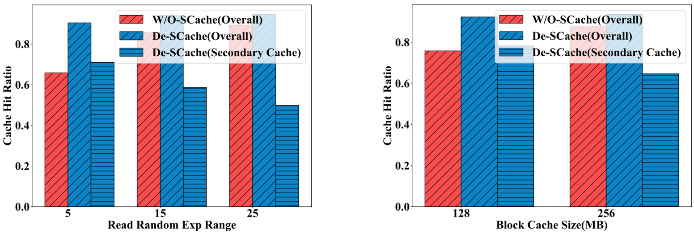
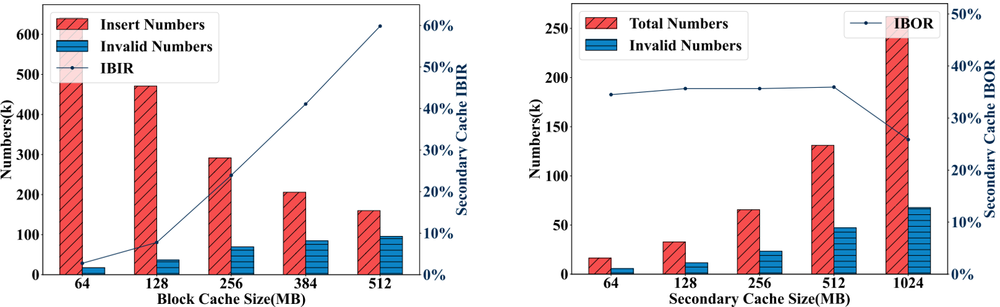
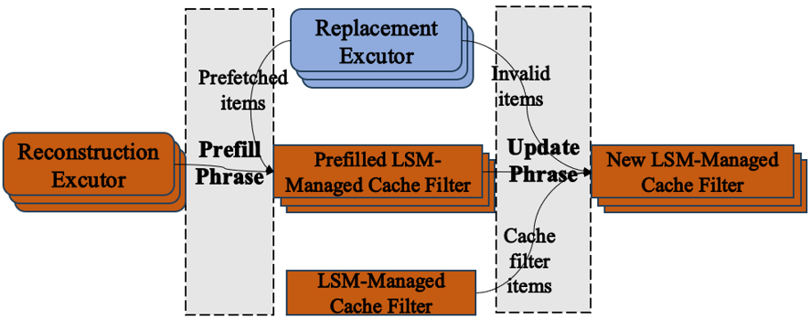
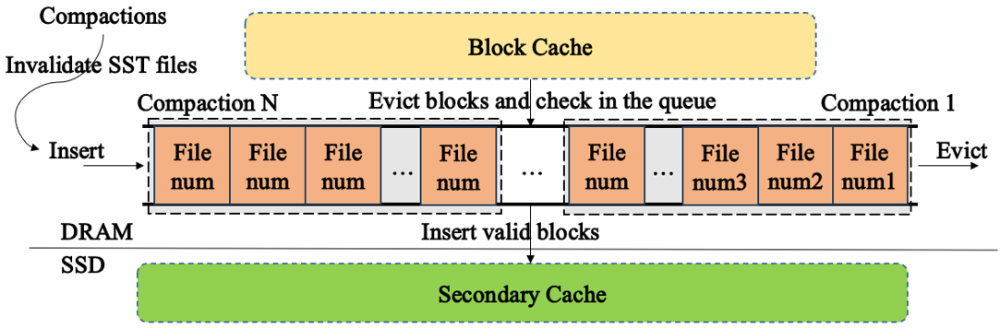
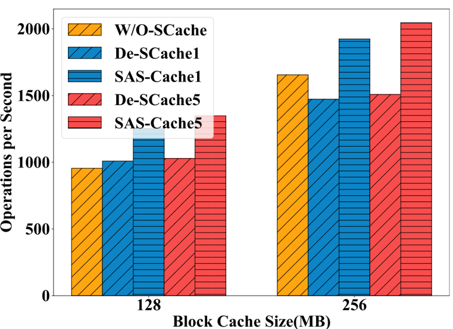
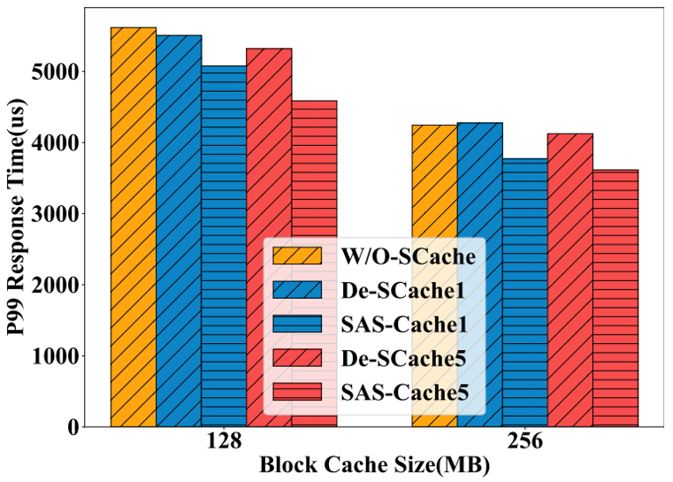

# SAS-Cache: A Semantic-Aware Secondary Cache for LSM-based Key-Value Stores

## Background

1. When LSM-KV stores are deployed on distributed storage systems, it suffers high read latency due to I/Os through the network.

2. Meta officially propose secondary cache to bridge the gap between block cache and the distributed storage systems.

3. The secondary cache also extend the cache space with high cost-effectiveness.

## Motivations

Current secondary cache can cause explicit read performance regression due to the ignorance of lookup and insertion overhead and the influence of compaction on the cache.

1. There exists missed lookups to secondary cache.

2. There exists invalid blocks evicted from block cache and inserted into secondary cache. 

3. There exists large amount of invalid items retained in the secondary cache.

## Challenges

1. How to design a novel cache filter which can sync with the cache content with low overhead?

2. How to prevent invalid blocks from being inserted into the secondary cache with low memory assumption?

3. How to identify and handle the invalid blocks retained in the secondary cache with low overhead, and compensate for the decreased hit ratio?

## Proposed Schemes

1. LSM-Managed Cache Filter: employs a lightweight synchronization method for regular cache items and asynchronous reconstruction to synchronize invalid cache items.

2. Valid SST-Aware Insertion Control: employs recording compacted file numbers instead of cache item cache-keys, and utilize a queue to manage these file numbers.

3. Compaction-Aware Cache Replacement: async prefix eviction utilizing the file numbers, and multi-level prefetching.

## Evaluation Results

SAS-Cache can achieve about 36% of the throughput improvement, and 20% of latency reduction compared with the state-of-theart secondary cache.

## Implementation and Setup Instructions

DeS-Cache Implementation: https://github.com/asu-idi/SAS-Cache/tree/DeS-Cache.

SAS-Cache Implementation: https://github.com/asu-idi/SAS-Cache/tree/SAS-Cache.